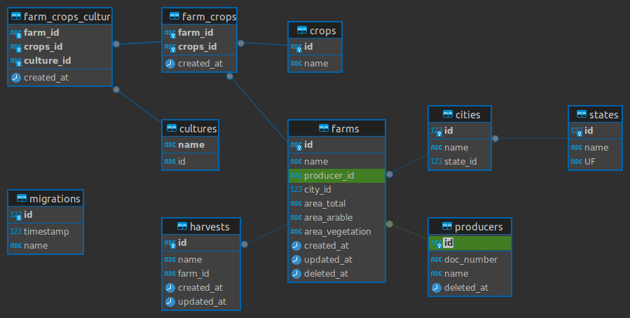

<p align="center">
  <a href="http://nestjs.com/" target="blank"></a>
</p>

## Description

Project brain 🚀 desenvolvido usando as melhores práticas e com nestjs, typeorm, swagger e muito mais.

## Diagrama do projeto



# RODANDO COM DOCKER

ao baixar o projeto e ter instalado o docker em sua maquina seguem os passos

subir o container

```bash
 docker-compose up --build -d
```

so subir precisamos rodar as migrations(criar as tabelas do sistema)

entramos no container com o comando

```bash
 docker exec -it serasa sh
```

Executamos as migrations

```bash
npm run migration:run
```

Executamos as SEEDS (popular as tabelas com os dados iniciais como no caso dos estados e cidades)

```bash
npm run seed:run
```

pra sair do shell basta usar o comando

```bash
exit;
```

para verificar o funcionamento podemos acessar os links abaixo

[SWAGGER - http://localhost:3000/swagger#/](http://localhost:3000/swagger#/)

[API - http://localhost:3000](http://localhost:3000)

## executando os testes na raiz do projeto backend execute os comandos

### desenvolvi os testes em alguns dos arquivos

```bash
npm run test - comando para testes unitarios
npm run test:cov - comando para executar os testes e gerar o arquivo de cobertura na pasta /coverage/lcov-report/index.html(pode abrir no navegador este arquivo basta arrastar no navegador como uma nova aba)
npm run test:e2e - comando para testes de aplicação
```

# EXECUTANDO SEM DOCKER

```bash
$ npm install
```

## Running the app

```bash
# development
$ npm run start

# watch mode
$ npm run dev

# production mode
$ npm run prod

# criar migration
$ npm run migration:create -name=user
```

## Test

```bash
# unit tests
$ npm run test

# e2e tests
$ npm run test:e2e

# test coverage
$ npm run test:cov
```
